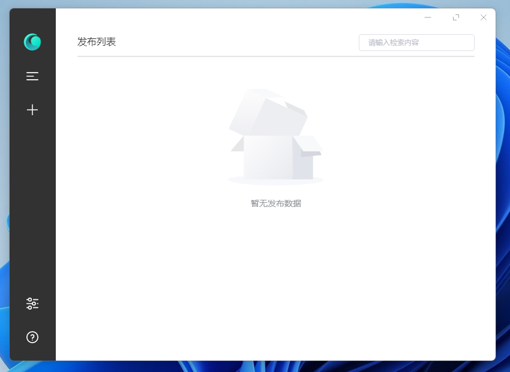
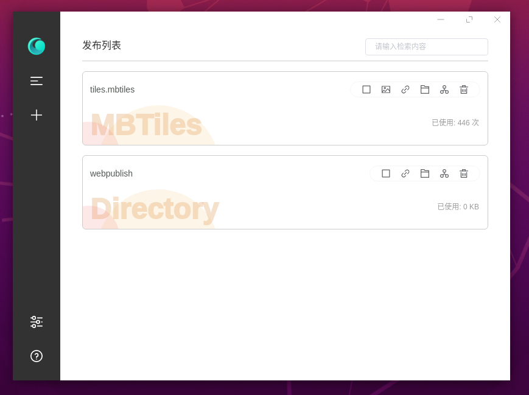

<div align="center">

</div>

<div align="center">
    <h1>WebPublish</h1>
    
     <a href="https://github.com/CandyAce/webpublish/actions">
   
    <a href="https://github.com/CandyACE/webpublish/blob/master/LICENSE">
    
 </a>
 </a>
</div>

一个快速发布文件夹、文件、MBTiles和代理的开发工具

## 安装包
* [WebPublish Windows](https://github.com/CandyACE/webpublish/releases)
* [WebPublish Linux](https://github.com/CandyACE/webpublish/releases)

## 背景

在工作中，经常会遇到需要发布一个页面，或者发布一个数据。这个时候配置nginx或者其他的就有点费劲，需要有个快速的工具来发布这些内容。

我的同事@IKangXu 开发了一个[c#/WPF版本的发布工具](https://github.com/IKangXu/ServiceListener)，挺好用。但是发布某个带有“+”的数据的时候链接错误找不到，并且每发布一个数据，就需要增加一个端口。有点浪费。

至此，我决定自己写一个发布小工具，nodejs对于请求吞吐比较好，所以决定使用electron来开发一个本地静态发布工具。因为是第一次写electron以及vue。也在不断的摸索之中。





## 支持能力

- [x] 开机自启
- [x] 支持设置gzip
- [x] 支持设置端口
- [x] 支持选择ip
- [x] 支持公用端口的服务单独设置二级路径（id）
- [x] 支持服务关闭和开启
- [x] 支持代理
- [x] 支持设置跨域(目前默认开启)
- [x] 支持最小化到托盘
- [x] 支持MBTiles
- [x] 多语言支持
- [x] 任务检索
- [x] 支持Linux
- [x] 支持MBTiles的png和pbf
- [x] 支持Cesiumlab的clt

## 使用文档

正在搭建中...

## 开始

一下说明将为你提供在本地计算机上启动并运行该项目源代码。

### 先决条件

> Nodejs 12.21

### 安装

#### 克隆项目

首先下载项目到本地

``` bash
https://github.com/CandyACE/webpublish.git
```

国内的用户可以采取这种

``` bash
git clone https://gitee.com/tstwt/webpublish.git
```

#### 初始化项目
``` bash
npm install
```

#### 调试项目
``` bash
npm run dev
```

#### 打包项目
``` bash
npm run build
```

## License
This project is licensed under the MIT License - see the [LICENSE.md](https://github.com/CandyACE/webpublish/blob/master/LICENSE) file for details.