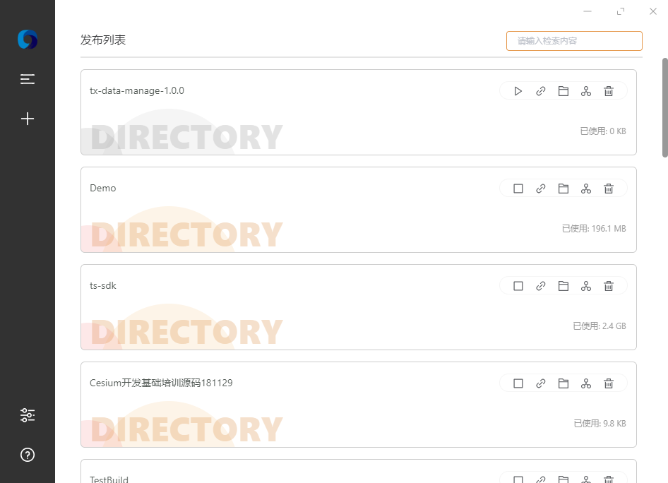

# Web Publish

获取[稳定版](http://webpublish.tangweitian.cn)

在工作中，经常会遇到需要发布一个页面，或者发布一个数据。这个时候配置nginx或者其他的就有点费劲，需要有个快速的工具来发布这些内容。

我的同事@IKangXu 开发了一个[c#/WPF版本的发布工具](https://github.com/IKangXu/ServiceListener)，挺好用。但是发布某个带有“+”的数据的时候链接错误找不到，并且每发布一个数据，就需要增加一个端口。有点浪费。

至此，我决定自己写一个发布小工具，nodejs对于请求吞吐比较好，所以决定使用electron来开发一个本地静态发布工具。因为是第一次写electron以及vue。也在不断的摸索之中。

不仅仅是发布上来。而是看到网络上没有相似的工具，希望能够好好的维护起来，也欢迎大家更新提交。

路线图：

- [ ] 支持插件**（2.0大版本实现）
- [x] 关于和设置页面
- [x] 开机自启
- [x] 支持设置gzip
- [x] 支持设置端口
- [X] 支持选择ip
- [ ] ~~支持每个服务单独设置端口~~（脱离了开发这个工具的意义）
- [x] 支持公用端口的服务单独设置二级路径（id）
- [x] 界面美化
- [x] 支持服务关闭和开启
- [ ] 支持批量操作
- [ ] 支持代理
- [x] 支持设置跨域(目前默认开启)
- [ ] 支持api调试模式（自定义接口返回）
- [x] 支持最小化到托盘
- [ ] 支持悬浮窗
- [ ] 减小依赖打包，缩小体积
- [x] 支持MBTiles
- [x] 多语言支持
- [x] 任务检索
